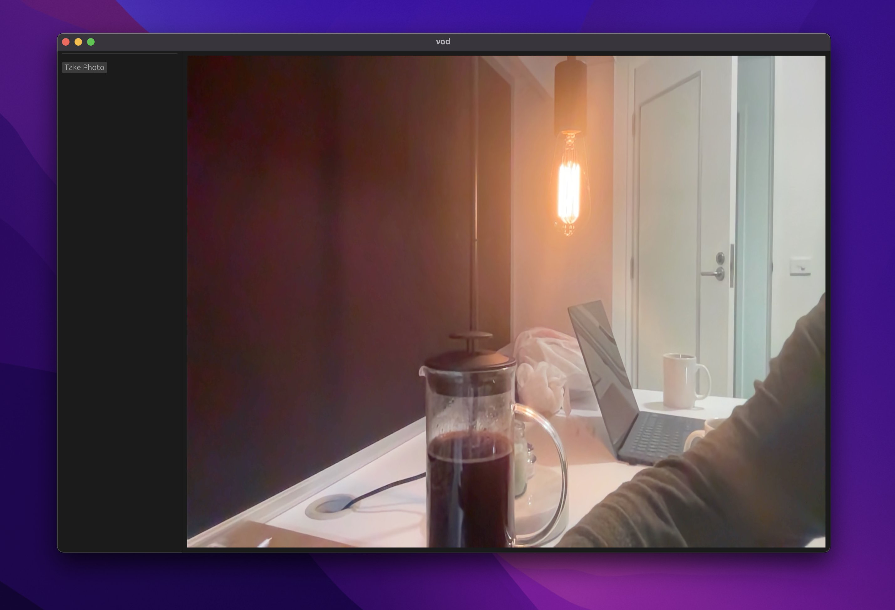

# Vod



Vod is my take on [kcam](https://github.com/donkeyteethUX/kcam), which is a linux webcam app built in rust. I've always wanted to try out something like egui and have been delving a bit into Rust C interop for another project, so why not implement similar functionality for OSX.

The only functionality currently implemented is the ability to take a picture of the current frame - I'll probably add some more features later.

# References
[fetching webcam data](https://gist.github.com/bellbind/6954679)

[original kcam post](https://www.reddit.com/r/rust/comments/wyjhmo/handy_linux_webcam_app_wegui/)

# Compilation
```cargo build --release && ./target/release/vod```

